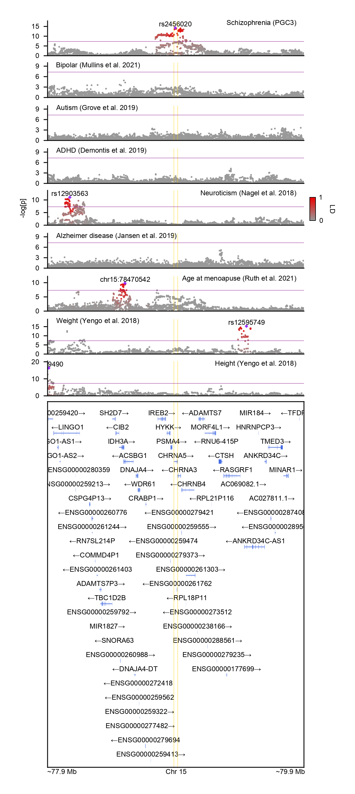

# GeneticsMakieExamples

An example Julia code for generating LocusZoom plots.

To run, open Julia v1.6 + within the folder and type
```julia
julia> ]
pkg> activate .
pkg> instantiate
```

## Required data
    data
    ├── adhd.chr15.txt.gz                          # adhd        GWAS sumstats
    ├── alz.chr15.txt.gz                           # alz         GWAS sumstats
    ├── asd.chr15.txt.gz                           # asd         GWAS sumstats
    ├── bd.chr15.txt.gz                            # bd          GWAS sumstats
    ├── height.chr15.txt.gz                        # height      GWAS sumstats
    ├── menopause.chr15.txt.gz                     # menopause   GWAS sumstats
    ├── neuroticism.chr15.txt.gz                   # neuroticism GWAS sumstats
    ├── scz.chr15.txt.gz                           # scz         GWAS sumstats
    ├── weight.chr15.txt.gz                        # weight      GWAS sumstats
    ├── gencode.v39lift37.annotation.chr15.gtf.gz  # GENCODE v39
    └── kgp.chr15.{bed, bim, fam}                  # 1000 Genomes EUR reference

<p align="center"></p>
