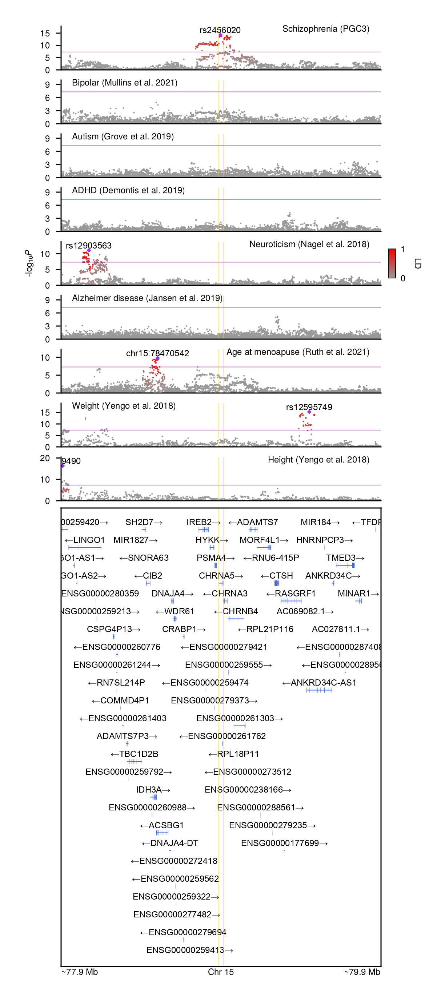

# GeneticsMakieExamples

Example Julia code for generating phenome-scale LocusZoom plots.

To run, open Julia within the folder and type
```julia
julia> ]
pkg> activate .
pkg> instantiate
```

Of note, the 1000 Genomes PLINK files `kgp.{bed, bim, fam}` need to be pre-downloaded in the `data` folder.
The rest of the required files are downloaded when first running code.

<p align="center"></p>
